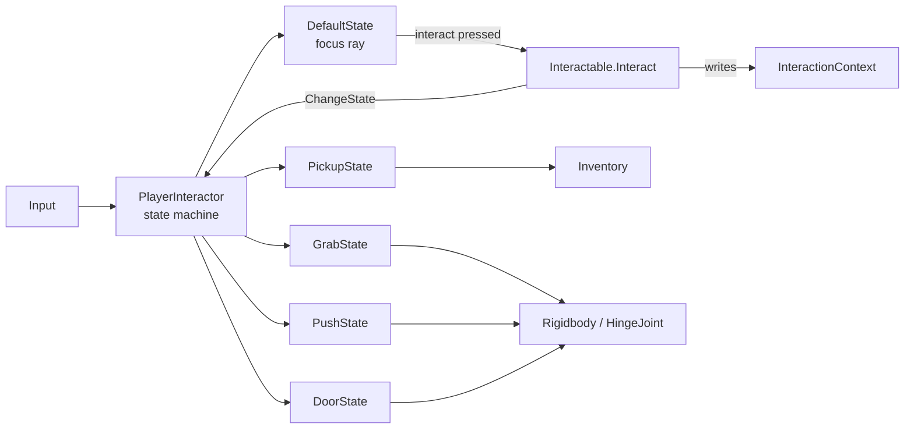

# Amnesia-Style Interaction System for Unity

Amnesia's interaction system is a state machine on the player, fed by interactable props. A focus ray finds the prop. The prop stores the hit in a shared context and switches the player into the matching state. That state turns input into a target velocity along the motion the object allows, and a PD controller turns the velocity error into force or torque. For your game that means five states: Default, Pickup, Grab (with optional throw), Push and Door.

This document has three parts:

- **Part 1, Handoff.** What has been built in Sanctify, how it differs from the original design, and where to look. Read this first. Where it disagrees with Part 2, Part 1 and the code win.
- **Part 2, Original design reference.** The research write-up the system was ported from, annotated with build status. Push and Door aren't built yet, and Part 2 is still their spec.
- **Part 3, Plan.** The remaining work in order, with open questions for the user.

# Part 1: Handoff (status as of 2026-09-23)

The core system, Pickup, Grab and throw, a cursor-based "interact mode", and crouch/tiptoe are built and compile cleanly. Switches, doors, levers, drawers, push, HUD, inventory and outlines aren't. All the code is in commit `68fb9b0` on `main`. This file is untracked.

## Status

All paths are under `Assets/Scripts/` unless noted.

| Piece | Status | Where |
| --- | --- | --- |
| State machine controller | Built | `Characters/Player/PlayerInteractor.cs` |
| State base, context, held-state base | Built | `Interaction/InteractionState.cs`, `InteractionContext.cs`, `HeldState.cs` |
| PD controller | Built | `Interaction/PD3.cs` |
| Prop base | Built, no per-prop crosshair yet | `Interaction/Interactable.cs` |
| DefaultState (focus and dispatch) | Built | `Interaction/States/DefaultState.cs` |
| Pickup | Built, inventory stubbed | `Interaction/PickupItem.cs`, `Interaction/States/PickupState.cs` |
| Grab and throw | Built, reworked from the design | `Interaction/PhysicsProp.cs`, `GrabData.cs`, `PlayerGrabSettings.cs`, `States/GrabState.cs` |
| Player/prop collision safety | Built | `Interaction/PlayerCollisionFilter.cs`, `CharacterMotor.SetIgnored` |
| Cursor interact mode | Built, new (not in the design) | `Characters/Player/PlayerInteractMode.cs` |
| Crouch and tiptoe | Built, interact mode only | `Characters/Player/PlayerStance.cs`, `CharacterMotor.TrySetHeight` |
| Cursor and focus text | Debug placeholder | `Debug/DebugCrosshair.cs` |
| Test props and rig tools | Built | `Editor/PlayerRigBuilder.cs` |
| Switches and buttons | Not started | |
| Doors and levers (hinge) | Not started | |
| Drawers (slide) | Not started | |
| Push and pull | Not started | |
| Held-object shadow | Built, untested | `Interaction/HeldObjectShadow.cs`, `Assets/Art/Interaction/` |
| HUD, per-prop crosshair, pickup outline, messages | Not started | |
| Inventory | Not started | `PickupItem.Take()` accepts everything and logs it |
| Interaction sounds | Not started | |

## Start here

These six files are the whole system. Read them in this order:

1. `Characters/Player/PlayerController.cs`. It holds the only Update, FixedUpdate and LateUpdate on the player, so it decides the order everything runs in.
2. `Characters/Player/PlayerInteractor.cs`. The state machine, the focus ray, and the view and aim poses that states use.
3. `Interaction/InteractionState.cs` and `Interaction/HeldState.cs`. The state contract.
4. `Interaction/States/GrabState.cs`. The most complete example of a physics state.
5. `Characters/Player/PlayerInteractMode.cs`. The cursor mode, which sits above the states.
6. `Editor/PlayerRigBuilder.cs`. How the player rig and the test arena are assembled.

## Working in this codebase

- **Engine.** Unity 6000.7.0b1 (Unity 6.7 beta), URP and the new Input System. Use the Unity 6 API names: `linearVelocity`, `linearDamping`, `angularDamping`. `FindObjectsByType<T>(FindObjectsSortMode)` is obsolete in this version, so use the overload without a sort mode.
- **Compiling.** The user keeps the editor open and compiles there. Don't compile from the command line: no batchmode Unity, no Roslyn or `dotnet` builds. After changing scripts, ask the user to let the editor recompile, then search `%LOCALAPPDATA%\Unity\Editor\Editor.log` for `error CS`.
- **Assemblies and namespaces.** There's one runtime assembly (`Assets/Scripts/Sanctify.asmdef`) and one editor assembly (`Assets/Scripts/Editor/Sanctify.Editor.asmdef`). Namespaces follow folders: `Sanctify.Characters` (motor and shared code), `Sanctify.Characters.Player`, `Sanctify.Cameras`, `Sanctify.Interaction`, `Sanctify.Debugging` and `Sanctify.Editor`. The camera namespace is `Cameras`, not `Camera`, to avoid clashing with `UnityEngine.Camera`.
- **Style.**
  - Classes are `sealed`.
  - Serialized fields are camelCase with a `[Tooltip]`; private fields are `_camelCase`.
  - Components use `[DisallowMultipleComponent]` and `[RequireComponent]`.
  - XML doc summaries explain why, not what.
  - Player subsystems have no Update of their own. They expose `Tick`, `FixedTick` and `LateTick`, and `PlayerController` calls them.
- **Tuning** lives in ScriptableObjects: player-wide settings in `Assets/Settings/Player/`, per-prop presets in `Assets/Settings/Interaction/`. Changes made in play mode persist there, which is why tuning doesn't go on components. The rig builder creates missing assets through `GetOrCreateAsset`, which never overwrites existing tuning.
- **Input** comes from `Assets/Input/Sanctify.inputactions` (map `Player`) and is read only through `PlayerInputReader`, which has one property per action. The file is plain JSON, and editing it directly works as long as new actions and bindings get fresh GUIDs.
- **Feel.** The game is modelled on King's Field IV: slow, heavy and deliberate. Tune toward that.
- **Scene.** `Assets/Scenes/SampleScene.unity` holds the player rig and the test arena. The builder doesn't update objects it already made, so after changing the test props, delete the `Motor Test Arena` object and create it again from the menu.

## Frame order and input routing

`PlayerController` runs everything:

```
Update       interactMode.Tick → look (routed) → actions (routed) → interactor.Tick → combat, magic
FixedUpdate  stance.FixedTick → movement (routed) + motor → interactor.FixedTick (state forces, then collision filter)
LateUpdate   cameraRig.Tick → interactor.LateTick → interactMode.LateTick (drawn cursor) → heldShadow.LateTick
```

- **Routing.** Input goes to the current interaction state first, through `PlayerInteractor.RouteLook`, `RouteMove` and `RouteAction`. The state returns `true` to let the normal action run as well, or `false` to swallow it.
- **Actions.** The routed actions are `InteractionAction.Interact`, `Attack` and `Magic`, each with a press and a release. Attack and Magic only reach combat and magic if the state passes them through. A swallowed Magic release cancels the charge.
- **Look is a rate, not a mouse delta.** It comes from the stick or arrow keys (-1 to 1) and `PlayerLook` ramps it. Part 2's "mouse accumulator" doesn't apply as written.
- **Control locks.** When `PlayerControlLock` blocks `Actions`, interact mode exits and `PlayerInteractor.Cancel()` returns to the Default state. A held object drops, and an unfinished pickup goes back where it was.
- **Interact mode reshapes input before routing.** It replaces look with its edge turn and takes the right stick for the cursor, which turns off peek. While something is held, it also zeroes strafe, because the bumpers set the held object's depth instead (`PlayerInteractMode.BumpersMoveHeldObject`).

## The state machine as built

It has the same shape as Part 2's pseudocode, with these differences:

- **Names.** The controller is `PlayerInteractor`, not `PlayerInteraction`. State IDs are `InteractionStateId { Default, Pickup, Grab }`, and each new state is registered in `PlayerInteractor.Awake`.
- **Entering a state.** A prop calls `Begin(interactor, id, body, hit)`, which calls `PlayerInteractor.BeginInteraction`. That checks `state.CanEnter(context)` first. If the state refuses, the current state keeps running. Grab uses this to refuse kinematic bodies and the body the player is standing on.
- **`Enter()` and `Exit()` take no arguments.** `ChangeState` sets `next.Previous = current` and makes the new state current before calling `Enter`, so a state can bail out from inside `Enter`. States leave with `ReturnToPrevious()`, and `ChangeState(null)` means Default.
- **The prop is passed the interactor.** There's no global player, so `Interactable.Interact(interactor, body, hit)` receives it. A prop remembers who is using it (`IsInteractedWith`), and its `OnDestroy` notifies that interactor, which ends the state.
- **`HeldState`** loads `Prop`, `Body` and `HitPoint` from the context and tracks `PropDestroyed`. Subclasses call `base.Enter()` first and `base.Exit()` last.
- **Extra hooks.** `LateTick` runs after the camera, for anything that follows the rendered view, such as the pickup lerp. There's no `OnScroll`: interact mode sets hold depth by calling `GrabState.AdjustDepth`.
- **Focus.** `DefaultState` uses `PlayerInteractor.CastFocusRay`. It casts from the rendered camera through `CursorViewport`, takes the nearest hit, and skips the player's own colliders and any trigger that doesn't belong to a prop. It exposes `FocusProp`. There's no HUD yet, so `DebugCrosshair` reads it.
- **Poses and services for states.** `PlayerInteractor` provides:
  - `FocusRay` and `AimDirection`: the rendered cursor ray, including head bob and peek. Use these for aiming and throwing.
  - `ViewPose` and `GetFixedStepAimRay()`: the same view and cursor direction at the latest physics step, without bob or interpolation. Physics goals use these, so held objects don't shake with the head bob.
  - `HoldPose`: where picked-up items travel to.
  - `Motor`, `Movement`, `GrabSettings` and `CollisionFilter`: services that states use.
- **`PD3`** has two outputs. `Output(error, dt)` differentiates the error, as in the design. `Output(error, errorRate)` takes the rate from outside, for example a measured velocity.

## Cursor interact mode

This is new, not part of the design. `PlayerInteractMode` recreates the cursor manipulation of old first-person dungeon crawlers. It sits above the states rather than being one, so the cursor keeps working while something is held.

- **Toggle.** R3 (keyboard: Tab) turns the mode on and off. Entering keeps the current view. The user found an automatic level-out of the pitch confusing, and it was removed.
- **Cursor.** The right stick (keyboard: IJKL) moves `Cursor` over the 4:3 view. `PlayerInteractor.CursorViewport` follows it, so focus, grabbing and throwing all go through the cursor. Outside the mode, the cursor is the centre of the view.
- **Edge turn.** Positions are measured from the centre in view units, where the cursor is drawn. While something is held, that's on the object, so a heavy object has to reach the edge itself.
  - **Starting.** The turn starts when the cursor reaches `edgeBandStart` (0.38) with the stick pushing toward that edge.
  - **Continuing.** It keeps going while the stick pushes that way. It stops as soon as the stick lets off or reverses, so a cursor left at the edge doesn't spin.
  - **Speed.** Turn speed follows how far out the cursor is: nothing at `edgeHoldStart` (0.2), full at `cursorLimit` (0.47). A held object that lags back from the edge slows the turn gradually instead of stopping it, so heavy things turn you slowly without stuttering. The state is kept per axis (`_edgeTurnX`, `_edgeTurnY`).
  - **Pitch.** In interact mode, pitch comes only from the edge turn. `PlayerController` passes `rawPitch` to `PlayerLook.Tick`, which skips Digital Pitch (King's Field-style on/off triggers) and Invert Pitch for it. Digital Pitch had been turning the smooth edge ramp into stop / full speed / stop.
  - The left stick still turns the player left and right.
- **Bumpers** call `GrabState.AdjustDepth` while something is held, and strafe is zeroed only then. With empty hands they strafe as normal. (User decision, 2026-09-23.)
- **Triggers** set the stance through `PlayerStance`: RT is tiptoe and LT is crouch (keyboard: Up and Down).
- **Grabbing only happens in this mode, and toggles.** `PhysicsProp` overrides `Interactable.IsUsableBy` to require `PlayerInteractor.CursorMode`, so outside the mode loose objects aren't focused at all. `GrabState.OnAction` lets go on the next Interact press. (User decision, 2026-09-23.)
- **The drawn cursor sits on a held object.** `LateTick` runs after the camera and projects the grabbed point (`GrabState.TryGetDrawnGrabPoint`, the interpolated pose) through `PlayerInteractor.TryGetViewportPoint` into `DisplayCursor`. The stick still moves `Cursor`, which is now a hidden pull target. When the object is let go, dropped or thrown, `Cursor` jumps to where the object was drawn, so the visible cursor doesn't.
- **Leashes.** The hidden target is kept within `maxLead` (0.15 view units) of `DisplayCursor` every frame. The bumpers can't push the held depth more than `maxDepthLead` (0.25 m) past `GrabState.PointDepth`, where the object really is. The first version had no limit: with a heavy object, the target ran to the screen edge and turned the camera, which carried the goal away. The pull hit `maxPullForce`, which leaves no braking, and the object slingshotted. A light object trails by about c ÷ k = 0.12 s: about 0.11 view units at full cursor speed and 0.125 at a full-speed turn. The leash sits just above that, so only heavy or snagged objects reach it. The screen leash also pulls the target back while you turn with the left stick. After a fast turn with something heavy, the object therefore stays where it lagged to rather than springing back. The depth leash only limits the bumpers, so a prop's fixed hold depth isn't cut short.
- **Exit** (R3 again, or a lock on Actions) returns the stance to standing and calls `interactor.Cancel()`, which drops a held object and puts back an unfinished pickup. The focus ray snaps back to the centre at once, while the drawn cursor (`DisplayCursor`) eases back.
- **Tuning** is on the component: cursor speed, stick curve, cursor limit, return sharpness, edge band, depth speed and the two leashes.

## Controls

| Control | Normal mode | Interact mode |
| --- | --- | --- |
| Left stick Y / W, S | Walk | Walk |
| Left stick X / ←, → | Turn | Turn |
| Bumpers / A, D | Strafe | Strafe; while holding, move the held object nearer or farther |
| Triggers / ↑, ↓ | Pitch | RT tiptoe, LT crouch |
| Right stick / IJKL | Peek | Move the cursor; at the edge it turns the view |
| R3 / Tab | Enter interact mode | Exit interact mode |
| Circle / E | Interact at the centre (not loose objects) | Interact at the cursor; press to grab, press again to drop |
| Square / left mouse | Attack | Throw if holding |
| Triangle / F | Magic, swallowed while holding | Magic, swallowed while holding |
| Cross / Left Shift | Run | Run |

The Tiptoe and Crouch actions share their controls with `LookPitch`. That's safe because pitch input is ignored in interact mode, and the stance is only read there.

## Held-object shadow

It's hard to tell in first person where a held object is, especially when it's off the ground or being moved nearer or farther. `Interaction/HeldObjectShadow.cs` on the player root draws a soft shadow on whatever is directly below the held object, which makes its position easy to read.

- **Placement.** Each `LateTick`, it takes the held body's collider bounds, moved to the drawn (interpolated) pose. It casts down from their centre with `PlayerInteractor.CastSolid`, which skips the held body, the player and triggers. It then places a URP `DecalProjector`, created at startup, at the hit.
- **Size and fade.** The shadow's footprint is the bounds' x and z × `sizeScale`, with a minimum of `minSize`. Opacity fades from `opacity` at contact to nothing at `fadeHeight`. The projector only reaches `surfaceBand` above and below the surface, so the object itself isn't darkened until it's nearly touching.
- **Rendering.** It needs the Decal renderer feature, which is on `PC_Renderer` (the renderer the PC quality level uses) with URP's default settings. The shader is `Assets/Art/Interaction/SG_HeldShadowDecal.shadergraph`, a copy of URP's decal graph with angle fade turned on, so walls and prop sides fade out of the shadow (50–70° from upward-facing). The rig builder makes `M_HeldShadow.mat` and a generated blob texture, `T_HeldShadow.png`, next to it. Both can be edited or replaced.
- **Optional.** `PlayerController` doesn't require it. A rig without it, or without a material, just shows no shadow.

## Stance (crouch and tiptoe)

The player sets a requested stance on `PlayerStance`. Each fixed step, before movement, it moves the capsule height toward 1.2 m (crouch), 1.8 m (standing) or 2.05 m (tiptoe) through `CharacterMotor.TrySetHeight`. That resizes the capsule from the feet up.

- **Shrinking** always succeeds.
- **Growing** is capsule-cast against the headroom and stops short of anything overhead. It's retried every step, so a crouch under a ledge rises by itself once the player walks clear.
- **The camera stays inside the capsule.** `EyeOffset` (the height change from standing) is interpolated into the camera rig's eye height, which keeps the eyes a fixed 0.15 m below the top of the capsule.
- **Only interact mode** requests anything other than standing.

## Grab and throw as built

This differs from Part 2. User testing rejected the Amnesia grab for three reasons:

- Objects followed the cursor almost one-to-one.
- Their rotation was locked to the view.
- They jittered even while the player stood still.

The jitter was a real instability. Amnesia's spin gain of 100 closes the angle error in 0.01 s, which is half of one 0.02 s Unity physics step. So each step overshoots by about 1.6×, the D term adds a kick every time the error changes sign, and the object ends up flipping back and forth at the spin cap. **Don't bring back Part 2's grab gains.**

How `GrabState` works now:

- **Pulled by the grabbed point.** The point that was grabbed (stored in body space, from the hit) is pulled toward a goal by a spring. The goal is on the fixed-step cursor ray at `_depth`, plus a view-space offset for props that use a pose offset. The force is applied at that point with `AddForceAtPosition`.
- **Damped against the player's movement, not the goal's.** The PD gives the point's wanted acceleration, `PD(goal − point, −(pointVelocity − playerVelocity))`. Walking carries the object along, while dragging the cursor or turning makes it trail by roughly damping ÷ stiffness seconds.
- **Sized by the point's effective mass, not the body's.** A push away from the centre of mass partly turns the body instead of moving it. So a point far from the centre behaves as if it's lighter than the whole object: a plank's end acts like about a quarter of the plank's mass, and a box's corner like about a fifth of the box's. `GrabState.EffectiveMassAt` builds the 3×3 matrix that maps a force at the point to that point's acceleration, then inverts it to get the force needed for a wanted acceleration. The first version multiplied by the whole mass instead. That overdrove off-centre points past what one physics step can settle (effective damping × `fixedDeltaTime` > 1), and objects buzzed and kept spinning.
- **Hangs from the grabbed point.** Gravity stays on. The point also gets a support force, effective mass × −gravity, which is exactly what a pivot would supply: the point holds still while gravity swings the rest of the object down below it. The support isn't counted against `maxPullForce`, so heavy objects lag but never drop. Props that hold their orientation get their weight carried at the centre instead, so gravity doesn't twist them.
- **Weight.** The pull is capped at `maxPullForce` newtons, so heavy objects lag behind. Carrying something heavy also slows the player, through `SpeedMultiplierFor` and `PlayerMovement.SpeedMultiplier`.
- **Holding a fixed angle is optional.** `GrabData.holdOrientation` (or `usePoseOffset`) adds a torque loop that keeps the grabbed angle relative to the view. Its catch-up gain is capped at 0.9 ÷ `fixedDeltaTime`, so it can't overshoot within a step. `GrabState.Rotate` turns that held angle, but nothing calls it yet.
- **Keep-out.** The goal is pushed sideways until it's at least the capsule radius plus `keepOutMargin` from the player, so the cursor can't drag an object into the camera.
- **Swing damping about the grabbed point.** `GrabState.DampSwing` applies a braking torque equal to `swingDamping` × the angular momentum about the grabbed point. That momentum is the body's own spin plus its centre of mass travelling round the point. Unity's angular damping, which the first version raised, acts about the centre of mass only, so it barely touches a pendulum swing, where most of the motion is the centre of mass moving along an arc. A ball held at its surface got about 30% of the damping and kept swinging for about 8 s. A cap stops one step from taking off more than half the spin. Props that hold their orientation skip this; their spin loop already controls rotation.
- **While held**, mass is multiplied by `massMultiplier` and interpolation is on. `Enter` saves both and `Exit` restores them.
- **Break distance.** If the grabbed point gets farther from the eye than max(start distance, `maxDepth`, depth) × 1.1 + 0.2, the object drops.
- **Line of sight.** Each fixed step, `PlayerInteractor.HasLineOfSight` casts a ray from the eye to the grabbed point. The player, triggers and the held body itself don't block it. If the ray stays blocked for longer than `lineOfSightGrace` (0.5 s), the object drops.
- **Letting go** caps the object's speed at `maxReleaseSpeed` and its spin at `maxReleaseAngularSpeed`.
- **Throwing** (Attack while holding) sets the object's velocity along the line from the eye through the grabbed point, which is where the cursor is drawn, tilted up by `throwLoft` degrees. The speed is `throwStrength` × `GrabData.throwMultiplier` ÷ the object's real mass, capped at `maxThrowSpeed`, so weight decides how far it goes.
  - A multiplier above 1 is for dense throwables: `SO_Grab_Dense` uses 2.5 for the brick.
  - A multiplier of 0 means the object can't be thrown.
- **Tuning.**
  - Player-wide values are in `PlayerGrabSettings` (asset `SO_PlayerGrab`). Code defaults: stiffness 100, damping 12, `maxPullForce` 80 N, `swingDamping` 6 (swing dies to a tenth in about 0.8 s), `orientationResponse` 8, `maxSpin` 6, `spinCatchUp` 30, `grabPull` 0.08, `keepOutMargin` 0.15, `lineOfSightGrace` 0.5 s, `throwStrength` 8, `maxThrowSpeed` 14, `throwLoft` 8°. Release caps are 2 m/s and 4 rad/s. The player slows from 2 kg of carried mass down to 0.5× speed at 20 kg.
  - Per-prop values are in `GrabData` (assets `SO_Grab_Default` and `SO_Grab_Dense`).

## Pickup as built

This matches Part 2's pickup, with these changes:

- **Timing.** The item eases to `PlayerInteractor.HoldPose` in `LateTick`, after the camera has moved, and `Take()` runs at the `takeAt` point.
- **Taken items are hidden first.** When `Take()` succeeds the item is hidden, and it's destroyed in `Exit`. The pickup animation finishes instead of ending the moment the prop is destroyed.
- **Refused or interrupted pickups are restored exactly.** The item goes back to its starting pose, and its colliders, kinematic flag, interpolation and collision mode are all restored.
- **The player stands still.** Movement and look are swallowed during a pickup.
- **Own body only.** `PickupItem` uses its own Rigidbody, not whichever body the ray hit, so an item without a Rigidbody can't freeze a parent body.

## Keeping props from breaking player collision

The player is a kinematic Rigidbody, and `CharacterMotor` moves it with its own capsule casts (collide-and-slide, step-up and depenetration). Physics can't push the player, but the motor's queries treat every dynamic prop as solid. `Physics.IgnoreCollision` doesn't affect queries, so three things handle held objects:

- **`CharacterMotor.SetIgnored(collider, bool)`** leaves colliders out of the motor's queries.
- **`PlayerCollisionFilter`** is owned by the interactor and ticked every fixed step. It applies both kinds of ignore to every collider on a held body. After release it keeps ignoring that body until `Physics.ComputePenetration` shows it no longer overlaps the player's capsule, so dropping something inside yourself doesn't pop the player out.
- **Grab refuses the body the player is standing on.**

## Test tools and scene

The **Sanctify → Player** menu has three commands:

- **Create Player Rig In Scene** builds the full rig and assigns its settings assets.
- **Create Motor Test Arena** builds the movement test geometry, adds interaction test props south of the centre, and runs the upgrade command below. The test props:
  - Pickup table (z −7): key (no Rigidbody), herb, 25 coins, lantern (custom focus text), and sealed idol (interaction disabled).
  - Floor and pedestal: a tome on the floor, and a relic on a pedestal with a slow 3 s pickup for testing interruptions.
  - Stance tests: a bottle on a 2.3 m shelf (tiptoe) and a ring under the 1.5 m low ceiling (crouch).
  - Grab table (z −10.5): small box, ball and brick (dense).
  - Grab floor: an 8 kg crate, a 25 kg chest, a plank, and a stool made of five colliders.
  - Throw target: a stack of three boxes at z −15.
- **Upgrade Player Rigs In Scene** adds components that newer code requires (`PlayerStance`, `PlayerInteractMode`, `HeldObjectShadow`) to existing rigs and fills in empty settings and material references. It creates the held-shadow material and texture if they're missing. Extend it whenever you add a player component or settings asset, or the user's existing rig breaks.

Debug aids:

- `PlayerControlLock` has a **Debug Block** field for testing interruptions.
- `PlayerInteractor` draws the focus ray in the Scene view whenever Interact is pressed.

## Known issues and loose ends

- **The latest round hasn't been playtested yet.** It covers:
  - the edge turn that starts at the edge and keeps going while pushed, with raw pitch
  - the held-object shadow
  - the Decal renderer feature
  - `SO_PlayerLook` rewritten with its current field names and the values it already used

  The leashes, swing damping and strafing were played before this. The user reported jerky edge turning, especially for pitch, and difficulty judging a held object's position, and this round addresses both.
- **Things to watch in that playtest:**
  - Grabbing an object from below flips it over, so it hangs under the grabbed point. That's correct for a single point, but it may look odd.
  - Long hanging objects can swing through the player's body, because collision with the player is off while holding. The keep-out only moves the grabbed point.
  - Very heavy objects can still build up to cursor speed, and with the pull capped they can drift a little past where you stop. The leash bounds this but doesn't remove it; it reads as momentum.
  - Heavy objects are fully supported against gravity. To make them sag or drag along the floor instead, count the support against a cap.
- **`GrabState.Rotate` has no binding.** It only matters for props with `holdOrientation`. The user deferred rotation until after playtesting (2026-09-23).
- **`DebugCrosshair` is an OnGUI placeholder** for the cursor and focus text. The camera renders to a RenderTexture shown on an overlay canvas (`FixedAspectRenderer`), so real UI must position itself with `FixedAspectRenderer.ViewScreenRect` or `ViewportToGuiPoint`, not the raw screen size.
- **`HoldPose` ignores the cursor.** Picked-up items always travel to the lower right of the view, even when grabbed at the edge of the screen in interact mode.
- **`PhysicsProp` has no mode field yet.** Push and Slide should add one, as Part 2 describes.
- **The player never pushes props, and props never push the player.** The capsule is kinematic and moved by teleporting. If something ends up inside it, the motor pushes the player back out. So a door swung into the player stops dead, but a door that's already overlapping the player shoves them out. Keep this in mind for Door and Push.

---

# Part 2: Original design reference

This is the research write-up the system was ported from. Each section starts with a **Status** note. For built pieces the code is authoritative, and the pseudocode is kept only to explain intent.

## Architecture

Amnesia splits interaction into three layers that never reach into each other. Props own their data and decide which state to use. The player owns input and the state machine. Each interaction state owns the physics for one kind of motion.

| Amnesia piece | Job | Unity equivalent | Status in Sanctify |
| --- | --- | --- | --- |
| Player (`cLuxPlayer`) | Holds one instance of every state, routes input to the current one, switches states | `PlayerInteraction` MonoBehaviour on the player | Built as `PlayerInteractor` |
| Base state (`iLuxPlayerState`) | Enter, Leave, Update, PostUpdate, and input callbacks that return "also do the default" | `InteractionState` plain C# class | Built |
| Default state (`DefaultBase`) | Focus ray, crosshair, focus text, calls the prop's interact | `DefaultState` | Built; `DebugCrosshair` stands in for the HUD |
| Interact base (`iLuxPlayerState_Interact`) | Reads the shared context, flags the prop as in use, exits if the prop is destroyed | `HeldState` base class | Built |
| Rotate base (`InteractRotateBase`) | Shared hinge logic; door, lever and wheel override only "mouse to speed" and "throw" | `HingeState` base, with `DoorState` on top | Not started (Part 3, step 3) |
| Grab, Push, Slide states | One state per motion type | `GrabState`, `PushState`, `SlideState` for drawers | `GrabState` built and reworked; Push and Slide not started |
| State vars (`cLuxPlayerStateVars`) | Static context holding body, prop and hit point, written by the prop before the switch | `InteractionContext` struct on `PlayerInteraction` | Built; `PlayerInteractor.Context` |
| Props (`iLuxProp` subclasses) | Per-object data plus an interact handler that picks the state | `Interactable` subclasses: `PickupItem`, `PhysicsProp`, `Door` | `PickupItem` and `PhysicsProp` (grab only) built; `Door` not started |
| Prop data (grab, push, move data) | Tuning values loaded from each entity file | ScriptableObject presets | `GrabData` built |
| Interact connections | Link a prop's motion to other entities, such as a rope or mover | UnityEvents or a small linked-mechanism component | Only `Interactable.onInteract` and `PickupItem.onPickup` so far |

Amnesia's general prop class (`LuxProp_Object`) is one class with an interact-type field (grab, push or slide). It is not one class per type. Mirror that with a single `PhysicsProp` component and a mode enum.



The prop writes the context and requests the switch. The new state reads the context in Enter and works only on that body.

Four rules hold everywhere:

- **Separation.** Props never read input, and states never decide what an object is.
- **Restore on exit.** Every state saves what it changes in Enter and restores it in Exit.
- **Self-exit.** Every held state ends itself: button released, too far away, prop destroyed, or throw.
- **Input pass-through.** Input callbacks return true to let the default action (walk, look) run as well.

## Core pieces

> **Status: built.** See Part 1, "The state machine as built". The main differences: `Enter` and `Exit` take no arguments, `CanEnter` and `LateTick` were added, there's no `OnScroll`, and `PlayerController` drives the controller instead of it having its own Update.

Four small pieces carry the whole system. All pseudocode below is C#-flavoured, but it isn't meant to compile as-is.

**Context and state base.** These mirror Amnesia's state vars and base states.

```csharp
struct InteractionContext {
    Interactable prop;
    Rigidbody    body;        // the body actually hit
    Vector3      hitPoint;    // world space
}

abstract class InteractionState {
    protected PlayerInteraction player;
    public InteractionState previous;          // where to return on exit

    virtual void Enter(InteractionState prev) {}
    virtual void Exit(InteractionState next)  {}
    virtual void Tick(float dt)      {}        // Update: focus, visuals
    virtual void FixedTick(float dt) {}        // FixedUpdate: forces

    // Return true = also run the default action (walk, turn camera)
    virtual bool OnAction(Action a, bool pressed) => true;
    virtual bool OnLook(Vector2 delta) => true;
    virtual bool OnMove(Vector2 move)  => true;
    virtual void OnScroll(float amount) {}
    virtual void OnPropDestroyed(Interactable p) {}
}

abstract class HeldState : InteractionState {
    protected Interactable prop; protected Rigidbody body; protected Vector3 hitPoint;

    override Enter(prev) { (prop, body, hitPoint) = player.context; prop.isInteractedWith = true; }
    override Exit(next)  { prop.isInteractedWith = false; }
    override OnPropDestroyed(p) { if (p == prop) player.ChangeState(previous); }
}
```

**Controller.** Input is read in Update, forces are applied in FixedUpdate.

```csharp
class PlayerInteraction : MonoBehaviour {
    Dictionary<StateId, InteractionState> states;   // one instance each, created once
    InteractionState current;
    public InteractionContext context;

    void ChangeState(StateId id) {
        var next = states[id];
        if (next == current) return;
        current.Exit(next);
        if (!current.isTransient) next.previous = current;   // skip popups, like Amnesia
        next.Enter(current);
        current = next;
    }

    void Update() {
        if (current.OnLook(input.lookDelta)) look.Apply(input.lookDelta);
        motor.moveInput = current.OnMove(input.move) ? input.move : Vector2.zero;
        if (input.scroll != 0) current.OnScroll(input.scroll);
        foreach (var (a, pressed) in input.actionEdges) current.OnAction(a, pressed);
        current.Tick(Time.deltaTime);
    }

    void FixedUpdate() => current.FixedTick(Time.fixedDeltaTime);
}
```

**PD controller.** Amnesia's controllers are PID, but every interaction sets I to 0, so a PD is enough.

```csharp
class PD3 {
    float p, d; Vector3 lastError; bool first = true;

    Vector3 Output(Vector3 error, float dt) {
        var deriv = first ? Vector3.zero : (error - lastError) / dt;
        first = false; lastError = error;
        return p * error + d * deriv;
    }
    void Reset() => first = true;
}
```

**Mouse accumulator.** Held states swallow mouse look and store it, then use it on the next physics step.

```csharp
Vector2 mouseAdd; float lastInputTime;

override bool OnLook(Vector2 d) {
    mouseAdd += d;
    if (d != Vector2.zero) lastInputTime = Time.time;
    return false;                                   // camera does not turn
}

// In FixedTick: use mouseAdd, then clear it
bool idle = Time.time - lastInputTime > 0.05f;       // no input for a frame or so
```

Amnesia uses "mouse delta is zero" to stop objects dead. In Unity, several FixedUpdates can run in one frame, and all but the first would see zero. Use the short idle timer instead, or doors will stutter at low frame rates.

> **Status: not used.** Sanctify has no mouse look: look input is a ramped stick rate, and interact mode moves an on-screen cursor. Grab already follows the cursor ray directly, and Part 3, step 3 proposes the same for doors, which removes the need for this accumulator and its idle timer.

## Focus and dispatch

> **Status: built**, in `DefaultState`, `Interactable` and `PlayerInteractor.CastFocusRay`. The ray goes through `PlayerInteractor.CursorViewport`: the screen centre normally, and the cursor in interact mode. Not built yet: `CrosshairFor`, the HUD and the pickup outline. `Interact` takes the interactor as a parameter because there's no global player.

Amnesia always interacts through the centre of the screen. There's no free cursor. The default state casts one ray per frame, and the prop's own interact handler decides what happens next.

```csharp
class DefaultState : InteractionState {
    Interactable focusProp; Rigidbody focusBody; Vector3 focusPoint;

    override Tick(dt) {
        focusProp = null;
        var ray = cam.ViewportPointToRay(new Vector3(0.5f, 0.5f));
        if (Physics.Raycast(ray, out var hit, maxFocusDistance, interactMask,
                            QueryTriggerInteraction.Collide)) {
            var p = hit.collider.GetComponentInParent<Interactable>();
            if (p && hit.distance <= p.maxFocusDistance && !p.interactionDisabled) {
                focusProp = p; focusBody = hit.rigidbody; focusPoint = hit.point;
            }
        }
        hud.crosshair = focusProp ? focusProp.CrosshairFor(focusBody) : Crosshair.Default;
        hud.focusText = focusProp ? focusProp.focusText : "";
        outline.Set(focusProp is PickupItem ? focusProp : null);   // Amnesia outlines items only
    }

    override bool OnAction(Action a, bool pressed) {
        if (a == Action.Interact && pressed && focusProp && motor.allowsInteraction) {
            focusProp.Interact(focusBody, focusPoint);
            focusProp.onInteract?.Invoke();                     // script callback
            return false;
        }
        return true;
    }
}
```

Props share one base class. Each subclass writes the context, then asks for its state.

```csharp
abstract class Interactable : MonoBehaviour {
    public float maxFocusDistance = 2.5f;
    public string focusText;
    public bool interactionDisabled, isInteractedWith;
    public UnityEvent onInteract;
    public abstract Crosshair CrosshairFor(Rigidbody body);
    public abstract void Interact(Rigidbody body, Vector3 hit);

    protected void Begin(StateId state, Rigidbody body, Vector3 hit) {
        player.context = new InteractionContext { prop = this, body = body, hitPoint = hit };
        player.ChangeState(state);
    }
    void OnDestroy() => player.current.OnPropDestroyed(this);
}

class PhysicsProp : Interactable {             // Amnesia's LuxProp_Object
    public enum Mode { Grab, Push, Slide } public Mode mode;
    public GrabData grab; public PushData push; public SlideData slide;   // ScriptableObjects

    override void Interact(Rigidbody body, Vector3 hit) {
        body ??= mainBody;
        Begin(mode switch { Mode.Grab => StateId.Grab,
                            Mode.Push => StateId.Push,
                            _         => StateId.Slide }, body, hit);
    }
}
```

The `maxFocusDistance` value of 2.5 is a placeholder. Amnesia sets focus distance per prop in its entity files.

## Pickup to inventory

> **Status: built**, in `PickupItem` and `PickupState`. There's no inventory yet: `Take()` accepts every item and logs it. The item is hidden rather than destroyed at the grab frame (the second option in the design notes below), and an interrupted pickup restores the item's exact starting pose. See Part 1, "Pickup as built".

Amnesia picks items up instantly. Its item interact handler adds the item to the inventory, destroys the prop, plays a sound, shows a "picked up" message and runs the script callback, all in one call. If the inventory refuses the item, the prop stays in the world. Your short pickup animation is a new, non-physics state that wraps that same handler.

```csharp
class PickupItem : Interactable {
    public ItemDefinition item; public int amount = 1;
    public float duration = 0.6f, takeAt = 0.5f;          // normalised time of the "grab" frame

    override void Interact(Rigidbody body, Vector3 hit) => Begin(StateId.Pickup, body, hit);

    // Amnesia's item interact handler, moved to the grab frame
    public bool Take() {
        if (!inventory.TryAdd(item, amount)) { hud.Message("Inventory full"); return false; }
        audio.Play(item.pickSound);
        hud.Message($"Picked up {item.displayName}");
        onPickup?.Invoke();
        return true;
    }
}

class PickupState : HeldState {
    PickupItem item; float t; bool taken;
    Pose start; SavedBody saved;

    override Enter(prev) {
        base.Enter(prev);
        item = (PickupItem)prop; t = 0; taken = false;
        saved = SavedBody.From(body);                    // kinematic flag, colliders
        body.isKinematic = true; SetCollidersEnabled(item, false);
        start = new Pose(item.transform.position, item.transform.rotation);
        motor.locked = true;                             // King's Field: stand still
        hands.SetTrigger("Pickup");
    }

    override Tick(dt) {
        t += dt / item.duration;
        float k = EaseInOut(Mathf.Clamp01(t / item.takeAt));
        item.transform.SetPositionAndRotation(
            Vector3.Lerp(start.position, handSocket.position, k),
            Quaternion.Slerp(start.rotation, handSocket.rotation, k));

        if (!taken && t >= item.takeAt) {                // or an Animation Event
            taken = true;
            if (item.Take()) Destroy(item.gameObject);   // OnPropDestroyed -> exits early
            else { Restore(); player.ChangeState(previous); return; }
        }
        if (t >= 1) player.ChangeState(previous);
    }

    override bool OnLook(Vector2 d) => false;            // optional: freeze the camera
    override bool OnMove(Vector2 m) => false;

    override Exit(next) {
        if (!taken) Restore();                           // interrupted, e.g. by a hit
        motor.locked = false;
        base.Exit(next);
    }

    void Restore() { saved.ApplyTo(body); SetCollidersEnabled(item, true); }
}
```

Two design choices matter here. First, add the item at the grab frame, not at the end of the animation, so an interruption after that point doesn't lose the item. Second, when `Take()` destroys the item, `OnPropDestroyed` ends the state straight away. If you want the hand animation to finish anyway, hide the item instead of destroying it until the state exits.

For the pickup itself you can use an Animator trigger on first-person hands with an Animation Event on the grab frame. A simple timed lerp to a hand socket, as above, also works.

## Grab and throw

> **Status: built, then reworked. The pseudocode below is superseded.** Its gains are unstable at Unity's 50 Hz physics rate and caused visible jitter. User testing also rejected locking rotation to the view and following the cursor one-to-one. The code now pulls objects by the grabbed point with a softer, force-capped spring, rotation is free (holding the angle is optional), and throw speed comes from mass. See Part 1, "Grab and throw as built". `GrabData`'s depth, pose-offset and multiplier fields carried over. `throwImpulse` became `throwMultiplier`, and `useRotation` became the opt-in `holdOrientation`.

A held object chases a full goal pose that is defined relative to the camera. One PD drives position with force, a second drives orientation with torque. The object keeps the angle it had when grabbed, relative to your view, until you rotate it. Throwable and non-throwable objects are the same state; only the throw impulse differs.

```csharp
[CreateAssetMenu] class GrabData : ScriptableObject {
    public bool  useRotation = true;
    public bool  useFixedDepth;  public float depth = 1f;
    public float minDepth = 0.6f, maxDepth = 1.6f, depthStep = 0.1f;
    public bool  usePoseOffset;  public Vector3 positionOffset, rotationOffset;
    public float massMul = 1f, forceMul = 1f, torqueMul = 1f;
    public float throwImpulse;                         // 0 = cannot be thrown
}

class GrabState : HeldState {
    PD3 forcePd  = new(p: 400, d: 40);
    PD3 torquePd = new(p: 40,  d: 0.4f);
    Quaternion localRot; Vector3 localOffset; float depth, maxDist, heldMass;
    SavedBody saved; GrabData data;

    override Enter(prev) {
        base.Enter(prev);
        data = ((PhysicsProp)prop).grab;
        var camRot = cam.rotation;
        localRot    = data.usePoseOffset ? Quaternion.Euler(data.rotationOffset)
                                         : Quaternion.Inverse(camRot) * body.rotation;
        localOffset = data.usePoseOffset ? data.positionOffset
                                         : Quaternion.Inverse(camRot) * (body.position - hitPoint);
        depth = data.useFixedDepth ? data.depth : Vector3.Distance(hitPoint, cam.position) - 0.08f;

        saved = SavedBody.From(body);                   // mass, gravity, drag, interpolation
        float realMass = body.mass;
        body.useGravity = false;
        body.mass *= data.massMul;
        body.linearVelocity = body.angularVelocity = Vector3.zero;
        body.interpolation = RigidbodyInterpolation.Interpolate;
        IgnorePlayerCollision(body, true);
        heldMass = body.mass;                           // + any jointed child bodies

        motor.speedMul = Remap(realMass, minSlowMass, maxSlowMass, 1f, minSlowMul);
        maxDist = Mathf.Max(Vector3.Distance(cam.position, body.position), data.maxDepth) * 1.1f + 0.2f;
        forcePd.Reset(); torquePd.Reset();
    }

    override void OnScroll(float a) =>
        depth = Mathf.Clamp(depth + a * data.depthStep, data.minDepth, data.maxDepth);

    override bool OnLook(Vector2 d) {
        if (!(input.rotateHeld && data.useRotation)) return true;      // normal look
        localRot = Quaternion.AngleAxis(-d.x * 3.2f * Mathf.Rad2Deg, Vector3.up)
                 * Quaternion.AngleAxis(-d.y * 3.2f * Mathf.Rad2Deg, Vector3.right)
                 * localRot;
        return false;                                                  // camera stays put
    }

    override FixedTick(dt) {
        if (Vector3.Distance(cam.position, body.position) > maxDist) { player.ChangeState(previous); return; }

        var goalRot = cam.rotation * localRot;
        var goalPos = cam.position + cam.rotation * (localOffset + Vector3.forward * depth);

        var force = forcePd.Output(goalPos - body.position, dt) * heldMass;
        body.AddForce(Vector3.ClampMagnitude(force, maxForce) * data.forceMul);

        if (!data.useRotation) return;
        (goalRot * Quaternion.Inverse(body.rotation)).ToAngleAxis(out float deg, out var axis);
        if (deg > 180) deg -= 360;
        var wantedSpin = axis * (deg * Mathf.Deg2Rad * 100f);
        wantedSpin = Vector3.ClampMagnitude(wantedSpin, maxAngularSpeed);   // Amnesia: 6 rad/s
        var torque = torquePd.Output(wantedSpin - body.angularVelocity, dt);
        body.AddTorque(Vector3.ClampMagnitude(torque, maxTorque) * data.torqueMul, ForceMode.Acceleration);
    }

    override bool OnAction(Action a, bool pressed) {
        if (a == Action.Interact && !pressed) {                  // let go
            body.linearVelocity  = Vector3.ClampMagnitude(body.linearVelocity,  maxLeaveLinearSpeed);
            body.angularVelocity = Vector3.ClampMagnitude(body.angularVelocity, maxLeaveAngularSpeed);
            player.ChangeState(previous); return false;
        }
        if (a == Action.Throw && pressed && data.throwImpulse > 0) {
            body.linearVelocity = body.angularVelocity = Vector3.zero;
            body.AddForce(cam.forward * data.throwImpulse, ForceMode.Impulse);
            player.ChangeState(previous); return false;
        }
        return true;
    }

    override Exit(next) {
        saved.ApplyTo(body);                            // gravity, real mass back
        IgnorePlayerCollisionUntilClear(body);          // re-enable once it no longer overlaps
        motor.speedMul = 1f;
        base.Exit(next);
    }
}
```

Notes on the Amnesia details:

- **Rotation error.** Amnesia aligns the body's up and right axes separately. The quaternion angle-axis error above does the same job in one step. Its 100 gain means "close the error in about 1/100 s", which the speed cap then limits.
- **Torque mode.** Amnesia multiplies torque by the body's inertia. `ForceMode.Acceleration` gives the same result, because it skips the inertia division.
- **Release cap.** Capping velocity on release stops players flinging objects by whipping the camera around. Throwing is the only way to launch something.
- **Player collision.** The held body ignores the player while held. After release, Amnesia keeps ignoring the player until the object is fully outside the player's collider, which prevents the player being popped upward.

## Push and pull

> **Status: not started.** This section is still the spec. Read Part 3, step 5 before building it: `motor.Move` must not be called from the state, per-axis speed limits belong on `PlayerMovement`, and the camera window needs a new API on `PlayerLook`.

Push is for objects too heavy to lift. The player keeps walking normally, and the walk direction becomes the push direction. Two PDs keep the object honest: one removes sideways drift while you push, the other brakes it when you stop. The player's speed is capped to the object's speed, so pulling (walking backward) drags the object along at the same pace.

```csharp
[CreateAssetMenu] class PushData : ScriptableObject {
    public bool  pushAtPoint;                          // push where you grabbed, not the centre
    public float forceMul = 1f;
}

class PushState : HeldState {
    PD3 driftPd = new(p: 15, d: 0.1f);
    PD3 stopPd  = new(p: 10, d: 0.1f);
    Vector3 localAttach; float maxDist; Vector2 move; CameraLimits savedLimits; PushData data;

    override Enter(prev) {
        base.Enter(prev);
        data = ((PhysicsProp)prop).push;
        savedLimits = look.limits;
        look.limits = CameraLimits.Around(look.yaw, look.pitch, yawRange, pitchDown, pitchUp);
        localAttach = body.transform.InverseTransformPoint(hitPoint);
        var anchor  = data.pushAtPoint ? hitPoint : body.position;
        maxDist = Vector3.Distance(motor.feet, anchor) * 1.2f + 0.3f;
        driftPd.Reset(); stopPd.Reset();
    }

    override bool OnMove(Vector2 m) { move = m; return false; }   // motor driven in FixedTick

    override FixedTick(dt) {
        var attach = data.pushAtPoint ? body.transform.TransformPoint(localAttach) : body.position;
        if (Vector3.Distance(motor.feet, attach) > maxDist) { player.ChangeState(previous); return; }

        var vel = data.pushAtPoint ? body.GetPointVelocity(attach) : body.linearVelocity;
        var dir = Flat(motor.forward) * move.y + Flat(motor.right) * move.x;

        if (dir == Vector3.zero) {                                   // brake to a stop
            Apply(Flat(stopPd.Output(-vel, dt)) * body.mass, attach);
            motor.Move(Vector2.zero);
            return;
        }
        dir.Normalize();

        var velAlong = dir * Vector3.Dot(dir, vel);
        Apply(Flat(driftPd.Output(velAlong - vel, dt)) * body.mass, attach);   // kill sideways slide

        var (maxSpeed, pushForce) = motor.running   ? (runMaxSpeed, runForce)
                                  : motor.crouching ? (crouchMaxSpeed, crouchForce)
                                                    : (walkMaxSpeed, walkForce);
        if (velAlong.magnitude < maxSpeed || Vector3.Dot(velAlong, dir) < 0)
            Apply(dir * pushForce * data.forceMul, attach);

        // Player follows at the object's speed, unless it's about to hit the player
        var playerMax = Vector3.Dot(velAlong, dir) > 0 ? velAlong : Vector3.zero;
        bool hitsPlayer = body.SweepTest(dir, out var hit, 0.1f) && hit.collider == motor.collider;
        if (!hitsPlayer)
            motor.SetAxisSpeedLimits(Mathf.Abs(Vector3.Dot(motor.forward, playerMax)),
                                     Mathf.Abs(Vector3.Dot(motor.right,   playerMax)));
        motor.Move(move);
    }

    void Apply(Vector3 f, Vector3 at) {
        f = Vector3.ClampMagnitude(f, maxForce);
        if (data.pushAtPoint) body.AddForceAtPosition(f, at); else body.AddForce(f);
    }

    override bool OnAction(Action a, bool pressed) {
        if (a == Action.Interact && !pressed) { player.ChangeState(previous); return false; }
        return true;
    }

    override Exit(next) {
        look.limits = savedLimits;
        motor.ClearAxisSpeedLimits();
        base.Exit(next);
    }
}
```

A few behaviours fall out of this design:

- **Pulling.** Walking backward points the push direction at the player. The object moves toward the player, and the speed cap stops the player walking away from it.
- **Starting from rest.** The speed cap is zero until the object starts moving, so the player leans in and the object leads. You never get ahead of a stuck crate.
- **Camera window.** Yaw and pitch are clamped around the starting view. The player keeps facing the object without being locked in place.
- **Unity motor hook.** Your character motor needs a per-axis speed limit (forward and right) that this state can set and clear. With a `CharacterController`, clamp the local velocity components before calling `Move`.

## Doors

> **Status: not started.** The latch, lock, break distance, slam and "speed, not force" parts of this section are still the spec. For turning input into hinge speed, Part 3, step 3 proposes following the cursor ray instead of accumulating mouse deltas, because Sanctify has no mouse look. That also removes the handedness sign problem mentioned at the end of this section.

Doors don't take forces at the grab point. Mouse motion becomes a single "turn this way" number around the hinge axis. That builds a target spin speed, and a PD applies torque to reach it. The door prop adds a latch that snaps it shut near 0° and a lock that works by narrowing the hinge limit.

```csharp
[CreateAssetMenu] class DoorData : ScriptableObject {
    public float speedFactor = 1f, maxSpeed = 2f;       // rad/s
    public float slowDownFactor = 1f, throwImpulse = 5f;
}

class Door : Interactable {
    public HingeJoint hinge; public DoorData data;
    public bool locked; bool closed; float lockedSoundCooldown;
    float openLimit;                                     // the hinge's real max angle

    override void Interact(Rigidbody body, Vector3 hit) {
        if (body == null || body.isKinematic) body = hinge.GetComponent<Rigidbody>();
        if (locked && lockedSoundCooldown <= 0) { audio.Play(lockedSound); lockedSoundCooldown = 0.5f; }
        if (!locked) SetClosed(false);
        Begin(StateId.Door, body, hit);                  // locked doors still rattle
    }

    void FixedUpdate() {
        lockedSoundCooldown -= Time.fixedDeltaTime;
        if (!closed && !isInteractedWith && Mathf.Abs(hinge.angle) < 10f) SetClosed(true);   // latch
    }

    public void SetClosed(bool c) {
        if (closed == c) return;
        closed = c;
        var lim = hinge.limits;
        lim.max = c ? 2f : openLimit;                    // closed = 2 degrees of play
        hinge.limits = lim;                              // struct: must reassign
        hinge.GetComponent<Rigidbody>().WakeUp();
        audio.Play(c ? closeSound : unlatchSound);
    }

    public void SetLocked(bool l) { locked = l; if (l) SetClosed(true); }
}

class DoorState : HeldState {                            // Amnesia's rotate base + swing door
    PD3 spinPd = new(p: 10, d: 1);
    Vector2 mouseAdd; float lastInputTime, rotSpeed, maxDist; Vector3 pivot, axis;
    bool savedGravity; DoorData data; HingeJoint hinge;

    override Enter(prev) {
        base.Enter(prev);
        var door = (Door)prop; data = door.data; hinge = door.hinge;
        mouseAdd = Vector2.zero; rotSpeed = 0; spinPd.Reset();
        savedGravity = body.useGravity; body.useGravity = false;
        pivot   = hinge.transform.TransformPoint(hinge.anchor);
        maxDist = Vector3.Distance(motor.feet, pivot) * 1.2f + 0.5f;
    }

    override bool OnLook(Vector2 d) {                      // mouse drives the door
        mouseAdd += d; if (d != Vector2.zero) lastInputTime = Time.time;
        return false;
    }

    override bool OnMove(Vector2 m) {                      // walk keys nudge it too
        mouseAdd += new Vector2(-m.x, m.y) * 0.01f;
        if (m != Vector2.zero) lastInputTime = Time.time;
        return true;                                       // and the player still walks
    }

    override FixedTick(dt) {
        if (Vector3.Distance(motor.feet, pivot) > maxDist) { player.ChangeState(previous); return; }

        // 1. Decay, and stop dead when input stops
        rotSpeed = Mathf.MoveTowards(rotSpeed, 0, Mathf.Abs(rotSpeed) * data.slowDownFactor * dt);
        if (Time.time - lastInputTime > 0.05f) rotSpeed = 0;

        // 2. Mouse to hinge speed
        axis = hinge.transform.TransformDirection(hinge.axis).normalized;
        var toBody = (body.worldCenterOfMass - pivot).normalized;
        var push   = (cam.up + cam.forward) * mouseAdd.y + cam.right * -mouseAdd.x;
        float speedAdd = Vector3.Dot(Vector3.Cross(toBody, push), axis);
        rotSpeed = Mathf.Clamp(rotSpeed + speedAdd * 3000f * data.speedFactor * dt,
                               -data.maxSpeed, data.maxSpeed);

        // 3. Torque toward that spin, around the hinge axis only
        var hingeSpin = axis * Vector3.Dot(axis, body.angularVelocity);
        var torque = spinPd.Output(axis * rotSpeed - hingeSpin, dt);
        body.AddTorque(Vector3.ClampMagnitude(torque, maxTorque), ForceMode.Acceleration);

        mouseAdd = Vector2.zero;
    }

    override bool OnAction(Action a, bool pressed) {
        if (a == Action.Interact && !pressed) { player.ChangeState(previous); return false; }
        if (a == Action.Throw && pressed) {                  // slam or fling open
            var toBody = (body.worldCenterOfMass - pivot).normalized;
            var swing  = Vector3.Cross(axis, toBody);
            if (Vector3.Dot(swing, cam.forward) < 0) swing = -swing;   // away from the player
            body.AddForce(swing * data.throwImpulse, ForceMode.Impulse);
            player.ChangeState(previous); return false;
        }
        return true;
    }

    override Exit(next) { body.useGravity = savedGravity; base.Exit(next); }
}
```

Why this feels good:

- **Direction always makes sense.** The cross product with the hinge-to-door vector means "push the mouse forward" opens the door away from you whichever side you stand on. Horizontal mouse turns the door the way you'd drag it.
- **Speed, not force.** Because the PD targets a spin speed, heavy and light doors respond the same way. Weight is expressed through `speedFactor` and `maxSpeed` instead.
- **Locked doors rattle.** The lock only narrows the limit to 2°, so a pull still gives a small, physical "it won't open" jolt.

Unity uses a left-handed coordinate system and Amnesia's is right-handed, so the sign of `speedAdd` may come out reversed. Test once: if pushing the mouse forward pulls the door toward you, flip the sign of `push`. The 3000 factor is tuned for Amnesia's mouse units, so expect to retune it against your look sensitivity.

The same state covers levers and drawers with small changes. A lever bends the camera axes toward the handle direction before the cross product. A drawer uses the slider variant, which dots the push with the slide axis and drives linear speed instead of spin.

## Unity mapping and starting values

Most of the port is one-to-one. The traps are units, handedness and Unity's defaults.

| Concept | Amnesia | Unity |
| --- | --- | --- |
| Physics step | Engine fixed step | `FixedUpdate`, `Time.fixedDeltaTime` |
| Mass-scaled force | Output × mass, then add force | `AddForce(f)`, or `ForceMode.Acceleration` and drop the × mass |
| Torque with inertia | Torque × inertia matrix | `AddTorque(t, ForceMode.Acceleration)` |
| Impulse | Add impulse | `AddForce(v, ForceMode.Impulse)` |
| Velocity | Linear velocity | `linearVelocity` in Unity 6, `velocity` before |
| Velocity at a point | Velocity at position | `GetPointVelocity(p)` |
| Gravity and sleep | Gravity flag, auto-disable | `useGravity`, `WakeUp()`, `sleepThreshold` |
| Ignore the player | Collide-character flag | `Physics.IgnoreCollision(playerCol, col)` per collider |
| Hinge axis and pivot | Pin direction, pivot point | `TransformDirection(hinge.axis)`, `TransformPoint(hinge.anchor)` |
| Hinge angle and limits | Radians | `hinge.angle` in degrees; `hinge.limits` is a struct, so reassign it |
| Overlap test | Shape collision check | `Rigidbody.SweepTest`, `Physics.ComputePenetration` |
| Camera forward | −Z | +Z |

Rigidbody settings to set while an object is held:

- **Interpolation.** Set `Interpolate` so held objects don't jitter between physics steps.
- **Collision detection.** Use `ContinuousDynamic` for small thrown items so they don't pass through walls.
- **Angular speed cap.** Check `maxAngularVelocity`. Older Unity versions default it to 7 rad/s, which can make grab rotation and fast doors feel sluggish.

| Setting | Amnesia value | Used in |
| --- | --- | --- |
| Position PD | P 400, D 40 | Grab |
| Rotation PD | P 40, D 0.4 | Grab |
| Spin target | 100 × error in radians, capped at 6 rad/s | Grab |
| Start depth | Hit distance − 0.08 | Grab |
| Break distance | max(start distance, max depth) × 1.1 + 0.2 | Grab |
| Mouse rotate factor | 3.2 × mouse delta | Grab |
| Drift PD | P 15, D 0.1 | Push |
| Stop PD | P 10, D 0.1 | Push |
| Break distance | Start distance × 1.2 + 0.3 | Push |
| Overlap test step | 0.1 units | Push |
| Spin PD | P 10, D 1 | Door |
| Mouse-to-speed factor | 3000 × per-door speed factor | Door |
| Walk-keys-to-mouse factor | 0.01 | Door |
| Break distance | Distance to pivot × 1.2 + 0.5 | Door |
| Latch | Shuts under 10°, then 2° of play | Door |
| Locked sound cooldown | 0.5 s | Door |

The max forces and torques, throw impulses, push speeds and the mass range for slowing the player come from Amnesia's config file, which isn't in the source repository. Start those from your own values and tune in play.

> **Status:** the Grab rows above (position PD, rotation PD, spin target and mouse rotate factor) are superseded; don't use them. The current values are in `PlayerGrabSettings` and listed in Part 1. The start-depth pull (0.08) and the break distance formula carried over. The Push and Door rows haven't been tried yet. When a PD or spin gain times `Time.fixedDeltaTime` (0.02 s) gets near 1, it overshoots every step, so check each gain against that before using it.

## Sources

- [Amnesia: The Dark Descent source](https://github.com/FrictionalGames/AmnesiaTheDarkDescent): the player interact states, prop classes and interact connections in the game folder.
- [Penumbra Overture source](https://github.com/FrictionalGames/PenumbraOverture): the earlier Grab, Move and Push states this system grew from.

Both are GPL v3. The pseudocode here describes the logic in new code rather than copying theirs, but check the license yourself if you plan to port anything line by line.

---

# Part 3: Plan for the rest of the system

The steps are ordered so each one can be tested in the arena before the next begins. The user prefers to work one step at a time. For every step:

1. Build the step.
2. Add test props to `PlayerRigBuilder.CreateTestArena`. If the player rig gains a component or settings asset, also add it to `UpgradePlayerRigs` and `CreatePlayerRig`.
3. Ask the user to recompile in the editor, then check `Editor.log` for errors.
4. Stop and wait for the user's feedback before starting the next step.

## Open questions for the user

Ask these before the step that needs them. Don't guess.

1. **Doors and levers in interact mode (step 3).** The proposal: the grabbed handle follows the cursor, constrained to the hinge's arc. In normal mode the same code works from the centre crosshair, so walking or turning drags the door, as in Amnesia. Is that the feel they want?
2. **Push in interact mode (step 5).** Should walking push, as in Part 2, in both modes? Or should the cursor set the push direction in interact mode?
3. ~~**Grabbing in normal mode (step 1).**~~ Answered 2026-09-23: grabbing only in interact mode. Built.
4. **Rotating held objects.** Deferred by the user until after playtesting (2026-09-23). If it's wanted, one option: while Triangle is held, the right stick rotates the object instead of moving the cursor. Magic is already swallowed while holding.
5. **Switches (step 2).** One-shot or toggle? Do they need a visible press or flip, or only an event?

## Step 1: Clean up and verify

Status (2026-09-23): the checklist passed except for the plank. The plank fix, three more issues the user reported (spinning held objects, a cursor that ran ahead of the object, no line-of-sight check), the answer to question 3 and the asset cleanup are all built. Next: recompile, then replay the checklist.

- Play through the arena using the checklist below, and fix anything that fails.
- ~~Delete `SO_Grab_Throwable.asset`. Re-save `SO_PlayerGrab`.~~ Done: the Throwable preset is deleted, and `SO_PlayerGrab` and `SO_Grab_Default` were rewritten with the current field names and unchanged values.
- ~~Apply the answers to questions 3 and 4.~~ Question 3 is built; question 4 is deferred.

Arena checklist:

- [ ] Every pickup works. The slow relic can be interrupted (set **Debug Block** to Actions on `PlayerControlLock`) and goes back exactly where it was.
- [ ] The bottle on the high shelf can be reached by tiptoeing, and the ring under the low ceiling by crouching. Letting go of crouch under the ceiling doesn't push the player through it.
- [ ] Held objects don't jitter while the player stands still.
- [ ] The plank swings from whichever end was grabbed.
- [ ] Held objects settle into hanging below the grabbed point and don't keep spinning.
- [ ] While holding, the cursor stays on the grabbed point. Letting go leaves it there.
- [ ] Holding the right stick toward the edge with the chest doesn't turn the view until the chest itself gets there, and letting go of the stick doesn't slingshot it. Pushing the chest out with the bumpers doesn't overshoot either.
- [ ] Edge turning is smooth in all four directions, with or without something held. Holding a heavy object turns you slowly but without stutter. Letting off the stick stops the turn.
- [ ] A held object casts a soft shadow directly below it. The shadow moves to the table when the object is over the table, darkens as the object is lowered, and doesn't smear up walls.
- [ ] Light objects follow the cursor as quickly as before.
- [ ] A held ball or brick stops swaying within about a second.
- [ ] In interact mode with empty hands, the bumpers strafe.
- [ ] Carrying something behind a pillar or round a corner drops it after about half a second. Passing it quickly behind a thin post doesn't.
- [ ] In normal mode, loose objects don't highlight and can't be grabbed. Pickups still work.
- [ ] The chest lags behind the cursor and slows the player down.
- [ ] Dropping the crate at your feet doesn't pop the player upward.
- [ ] Throw distance falls as mass rises, and the brick still flies far.
- [ ] Leaving interact mode with R3 drops the held object and stands the player up.

## Step 2: Switches and buttons

This is the simplest kind of prop, and it needs no new state. It proves non-physics interactables work and gives later steps something to link doors to.

- Add `Interaction/SwitchProp.cs`, a subclass of `Interactable`. Its `HandleInteract` flips its on/off state and invokes a `UnityEvent<bool>`. Options: one-shot, a cooldown, and a visual that moves or rotates a child transform over a short time (done in the prop, not a state).
- **Test props:** a wall button that toggles a light, and a lever-style switch.
- **Done when:** both work from the centre crosshair and from the cursor, and a disabled switch can't be focused.

## Step 3: Doors (HingeState and DoorState) and levers

The spec is Part 2, "Doors", with one change. Part 2 turns mouse movement into spin speed, but here look is a stick rate and interact mode has a cursor. Drive doors the way Grab works instead, toward the cursor.

- **Files:**
  - `Interaction/Door.cs`, a subclass of `Interactable`, with the hinge, latch and lock (sounds come in step 8).
  - `Interaction/DoorData.cs`, a ScriptableObject.
  - `Interaction/States/HingeState.cs`, an abstract base holding the shared hinge logic.
  - `Interaction/States/DoorState.cs`.
  - Add `InteractionStateId.Door` and register the state in `PlayerInteractor.Awake`.
- **Following the cursor:**
  1. Keep the grabbed point in body space, as `GrabState` does.
  2. Each fixed step, take the goal: the point on `GetFixedStepAimRay()` at the grab depth.
  3. Project the goal and the current grabbed point onto the plane at right angles to the hinge axis, through the pivot.
  4. The signed angle between them around the axis is the error. Wanted spin = error × gain, clamped to `DoorData.maxSpeed`.
  5. Apply torque about the axis only: `PD(wantedSpin − current spin about the axis)`, with `ForceMode.Acceleration`.

  Keep the gain well below the physics rate (Part 1 explains why). This replaces Part 2's mouse accumulator and idle timer, and avoids the handedness sign problem Part 2 warns about.
- **Normal mode:** the cursor is the centre of the view, so turning or walking drags the door. `OnMove` and `OnLook` return true.
- **Latch and lock:** as in Part 2.
  - Closed doors latch under 10° while nobody holds them, narrowing `hinge.limits` to 2°. `limits` is a struct, so reassign it after changing it.
  - `SetLocked` locks the door. Locked doors still rattle.
- **Ending the interaction:**
  - Interact follows the same rules as Grab: toggle in interact mode, release otherwise.
  - Break distance is the pivot distance × 1.2 + 0.5, measured from the feet.
  - Destroying the prop ends the state.
  - Attack slams the door or flings it open (Part 2's throw).
  - Restore gravity and anything else the state changed.
- **Player collision:** the player is kinematic, so a door swung into them stops, which is correct. While a door is held, consider a keep-out like Grab's, so the handle can't be pulled through the capsule.
- **Lever:** a `LeverProp` on `HingeState`, with a narrow limit and an event at each end. Hook it to step 2's events, so a lever can open a door.
- **Test props:**
  - A hinged door in a frame: door body with a Rigidbody and a `HingeJoint`, limits 0–100°.
  - A locked door that step 2's button unlocks.
  - A lever.
- **Done when:** the door opens both ways from either side by dragging the cursor, latches shut, and rattles when locked. It doesn't jitter at rest while held, and closing it on yourself doesn't glitch the camera.

## Step 4: Drawers (SlideState)

- **Mechanism:** a straight-line variant of step 3. Use a `ConfigurableJoint` with one free linear axis and limits. Project the cursor goal onto the slide axis, and drive the velocity along that axis with a PD.
- **Prop:** either give `PhysicsProp` a `Mode { Grab, Push, Slide }` field, as Part 2 suggests, or make a separate `Drawer` prop. Choose whichever reads better once step 3 exists.
- **Test props:** a cabinet with two drawers, one holding a pickup item. This checks that pickups on moving bodies still work.

## Step 5: Push and pull

The spec is Part 2, "Push and pull". It needs new hooks in existing systems:

- **`PlayerMovement`:** add per-axis speed limits (forward and right, in the player's local space) that `PushState` can set and clear. Apply them where `ComputeWish` builds the wished velocity. Movement still owns velocity. Don't call `motor.Move` from the state as Part 2's pseudocode does, because here that would move the player twice per step.
- **`PlayerLook`:** add a temporary yaw and pitch window around a centre, with save and restore, for Part 2's camera window. `PlayerLook` only has fixed pitch limits today.
- **New types:** `PhysicsProp.Mode.Push`, a `PushData` ScriptableObject, `InteractionStateId.Push`, and `States/PushState.cs`, with drift and stop PDs as in Part 2. `PushState.FixedTick` runs after movement in the current order, so its speed limits take effect on the next step. That's fine.
- **Motor contact:** the pushed body is solid to the motor, so the player stops against it and follows at the object's speed. Don't add it to the motor's ignore list. Use `body.SweepTest` as in Part 2 so the object can't pin the player.
- **Test props:** a heavy crate (40 kg) on open floor, and another in the funnel corridor, to check that it jams without the player clipping through.
- **Interact mode:** behave however the user answers question 2.

## Step 6: Feedback and HUD

- **Crosshair per prop:** add `Interactable.CrosshairFor(body)` (grab hand, push, door, pickup, switch). Replace `DebugCrosshair` with real UI on or over the `FixedAspectRenderer` canvas. The interact-mode cursor and the normal-mode dot should be the same element.
- **Text:** focus text, plus "Picked up X" and "Inventory full" messages.
- **Outline:** outline focused pickup items only, as Amnesia does. This needs a URP renderer feature or an inverted-hull material; check what the project's URP renderer supports.

## Step 7: Inventory

- Add an `ItemDefinition` ScriptableObject (name, icon, stack size, pickup sound) and an `Inventory` component on the player with `TryAdd(item, amount)`.
- Change `PickupItem` from its `displayName` string to an `ItemDefinition` reference, and have `Take()` call `TryAdd`. Refusals already work: a refused item goes back where it was.

## Step 8: Sound and connections

- **Sounds:** grab, drop, impacts (scaled by impact speed and rate-limited), door creak (scaled by swing speed), latch, locked rattle and pickup.
  - The project plan is one ScriptableObject per sound plus shared spatial profiles, through Steam Audio (`Assets/Plugins/SteamAudio`). Ask the user whether that sound system exists yet before building one.
- **Interact connections** (Part 2's levers and wheels driving doors or movers): the UnityEvents from steps 2 and 3 cover the simple cases. Only add a small linked-mechanism component if the user needs continuous coupling, such as a wheel that raises a gate as it turns.
